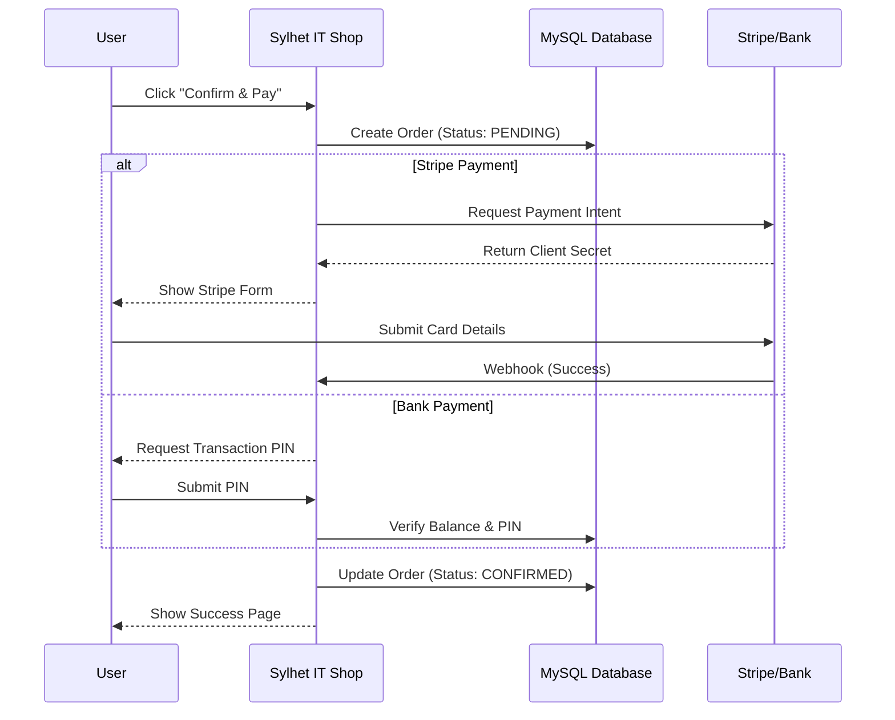

#  Sylhet IT Shop

[](https://sylhetitshop.zya.me)
[](https://www.php.net/)
[](https://www.mysql.com/)
[](https://stripe.com/)
[](https://sendgrid.com/)

**Sylhet IT Shop** is a comprehensive, full-stack e-commerce platform featuring a multi-user ecosystem (Customer, Admin, Supplier) and a custom integrated banking partner system ("SUSTainable Bank").

This project simulates a real-world production environment with secure authentication, B2B supply chain management, and multiple payment gateways including **Stripe (Credit Cards)**, **Google OAuth**, and a custom **Bank API**.

---
##  Key Features

###  For Customers

  * **Secure Authentication:** Login via **Google OAuth 2.0** or secure email/password (hashed).
  * **Modern Shopping Experience:** Responsive product gallery with "Quick View" modals and live cart updates.
  * **Multi-Payment System:**
      * **International:** Secure Credit Card payments via **Stripe Payment Intents**.
      * **Local:** Manual **bKash** verification flow.
      * **Bank:** Direct integration with **SUSTainable Bank** using a secure PIN system.
  * **Security:** 2-Step Verification (OTP) for linking bank accounts and resetting passwords.

###  For Admins (Operations)

  * **Analytics Dashboard:** Real-time charts (Chart.js) visualizing Stock vs. Demand and Revenue.
  * **Order Management:** Track order status (Pending, Confirmed, Delivered).
  * **Inventory Prediction:** Intelligent "Recommended Restock" logic based on current demand vs. stock.
  * **B2B Purchasing:** Integrated "Supply Market" to order products directly from suppliers.

###  Banking System (Simulated Partner)

  * **Independent Portal:** A fully functional banking system (`/bank_login.php`) with its own auth.
  * **Transaction Logic:** Handles internal fund transfers securely with transactional integrity (ACID).

-----

##  Project Gallery

###  Customer Journey

| Desktop View | Mobile View |
|:---:|:---:|
|  <br> **Product Market & Modal** |  <br> **Responsive Cart & Checkout** |
|  <br> **Secure Stripe Checkout** |  <br> **Order Confirmation** |

###  Admin & Analytics

| Admin Dashboard | Inventory Management |
|:---:|:---:|
|  <br> **Real-time Analytics & Charts** |  <br> **Order Fulfillment & Stock Predictions** |

---

##  System Architecture & Workflows

### 1. User Journey Flow
This flowchart illustrates the complete path a customer takes from landing on the site to successfully placing an order.

```mermaid
graph TD
    A[Visitor] -->|Visits| B(Landing Page)
    B --> C{Has Account?}
    C -- No --> D[Sign Up / Google OAuth]
    C -- Yes --> E[Login]
    D --> E
    E --> F[Product Market]
    F -->|Add Items| G[Shopping Cart]
    G --> H[Checkout Modal]
    H --> I{Payment Method}
    I -- Credit Card --> J[Stripe Gateway]
    I -- Internal Bank --> K[SUSTainable Bank API]
    J -->|Validates| L[Order Success]
    K -->|Validates PIN| L
    L --> M[Update Database]
    L --> N[Send Email Receipt]
````

### 2\. Database Schema (ER Diagram)

A visualization of the relational database structure linking customers, banking details, and order history.

```mermaid
erDiagram
    CUSTOMER_DETAILS ||--o{ ORDER_DETAILS : places
    CUSTOMER_DETAILS ||--|| BANK_DETAILS : links
    
    CUSTOMER_DETAILS {
        string email PK
        string name
        string password_hash
        string account_number_fk
    }
    
    ORDER_DETAILS ||--|| PAYMENT_DETAILS : tracks
    
    ORDER_DETAILS {
        string payment_id PK
        int laptop_qty
        int mobile_qty
        string status
    }
    
    PAYMENT_DETAILS {
        string payment_id PK
        string sender_account
        string receiver_account
        int amount
        string status
    }

    BANK_DETAILS {
        string account_number PK
        int current_balance
        string email
    }
```

### 3\. Payment Processing Sequence

Detailed interaction between the Client, Server, Database, and Payment Gateways during a transaction.



-----

##  Project Architecture & Modules

The project is structured into logical modules to separate concerns between the E-commerce front-end, Operational back-end, and the Banking partner system.

<details>
<summary> <b>E-Commerce Module (Customer Facing)</b></summary>

* `index.html` - Landing page with product showcase.
* `market.php` - Main shopping interface with AJAX-based cart updates.
* `cart.php` - Shopping cart with payment method selection modal.
* `checkout.php` - **Stripe** integration page handling secure card inputs.
* `customer_profile.php` - User dashboard for tracking orders and payment methods.
* `customer_login.php` / `customer_sign_up.php` - Secure auth pages.

</details>

<details>
<summary> <b>Operational Module (Admin & Supplier)</b></summary>

* `admin.php` - Main dashboard for business analytics and logistics.
* `supplier.php` - Supplier dashboard for fulfilling B2B orders.
* `buy.php` / `wholesale_cart.php` - B2B procurement flow for Admins.
* `operational_login.php` - Unified secure login for staff.

</details>

<details>
<summary> <b>Banking Module (Partner System)</b></summary>

* `bank_login.php` - Secure access for bank account holders.
* `bank_profile.php` - User balance and transaction history.
* `transaction.php` - Core logic handling secure fund transfers.

</details>

<details>
<summary> <b>Backend Services & APIs</b></summary>

* `create_payment_intent.php` - Generates Stripe payment intents.
* `stripe_webhook.php` - Listens for Stripe events to update database status securely.
* `smtp_mailer.php` - **SendGrid** integration for sending OTPs.
* `google_callback.php` - Handles **Google OAuth** responses and user creation.
* `config.php` - Database connection handling.

</details>

-----

##  Tech Stack

  * **Frontend:** HTML5, CSS3 (Responsive Grid/Flexbox), JavaScript (jQuery).
  * **Backend:** PHP 8.0+ (Object-Oriented structure).
  * **Database:** MySQL (Relational Schema).
  * **Security:**
      * `password_hash()` (Bcrypt) for credentials.
      * `mysqli_prepare()` for SQL Injection prevention.
      * `htmlspecialchars()` for XSS protection.

###  3rd Party APIs & Libraries

  * **Stripe API:** For secure credit card processing.
  * **SendGrid API:** For high-deliverability transactional emails (OTPs).
  * **Google OAuth 2.0:** For seamless user sign-in.
  * **Chart.js:** For data visualization in the Admin Dashboard.
  * **Canvas Confetti:** For UI interaction on success pages.

-----

##  Developer Info

**Md. Sazim Mahmudur Rahman** *Department of Computer Science and Engineering* *Shahjalal University of Science and Technology (SUST), Sylhet*

  * **Email:** [sazim87@student.sust.edu](mailto:sazim87@student.sust.edu)
  * **Registration No:** 2019331087

-----

###  License

This project is licensed under the [MIT License](https://www.google.com/search?q=LICENSE).
